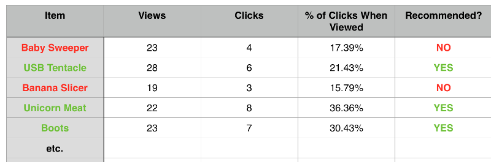

# Assignment Overview: Lab for Class 13

There are two parts to today's lab: a paired component that covers the new technical requirement, and then, individually, mop-up of the  if desired, a new stretch goal that you may work on individually. Your Canvas assignment for today will be for the pair programming portion; you'll have a final catch-all "Finish With BusMall" assignment that is due Friday morning.

## Pair Programming

We'll be starting in lab today with some pair programming in which you will fork, clone, and edit your partner's repository. Be sure to review the basic techniques of pair programming as presented in the lab assignment for Class 4. It would not hurt to make a checklist and work off that checklist.

Use the Driver/Navigator roles as outlined in that assignment document. The simple rule of it is that at no time should you type anything in your own code. And PLEASE PLEASE PLEASE make sure your repo is all synced up with itself (no lingering open PRs, and your laptop/GitHub in sync via `git push...`, PR merges as needed, and `git pull...`) before your partner forks it and clones their fork.

One part of the workflow will be different: when working on your partner's code, work on a new branch rather than working in the master branch. Mostly everything works the same; it will look a little different when making the PR back to your partner, so be attentive at that step.

For today's lab, part of your assignment is to help get your partner's project completed if it is not already. This will be good practice for project week and collaboratively working on hammering the functionality of a feature branch into place.

### New Bus Mall Technical Goal

- Give your BusMall app persistence by using local storage to store your voting data! The goal is to have all of your data persist through a page refresh or through completely closing the browser. That way, the more time you go through the sets of 25 votes, the more the data accumulates and you get a more reliable understanding of which items are popular.

## Individual Work

Be sure to go back and re-read [the original problem domain from Class 11](https://github.com/codefellows/seattle-201d17/tree/master/class-11-av-practical-clicktracker/lab). Today we'll be focusing on implementing all of the little pieces that have not been finished so far. Make sure you are not forgetting anything.

##### Hmmm...

- *"The marketing team is not only interested in the total number of clicks, but also the percentage of times that an item was clicked when it was shown. So, you'll also need to keep track of how many times each image is displayed and do the associated calculations."*

- Stretch goal (not required, but work on it if you'd like an additional challenge): Prepare a report for the marketing team that gives them a table of data analysis on a separate HTML page, maybe something like this:

- If you choose to build the table, you can do so however you want and also customize however you think is appropriate.

- You are also responsible for the overall look and feel of the app (the UI/UX, in other words), so don't forget a custom font, color palette, layout with semantic HTML, and so on. The basic layout of three side-by-side-by-side images with a chart underneath holds, but beyond that, it's all you.

### *Remember to submit this link in the Canvas assignment*
